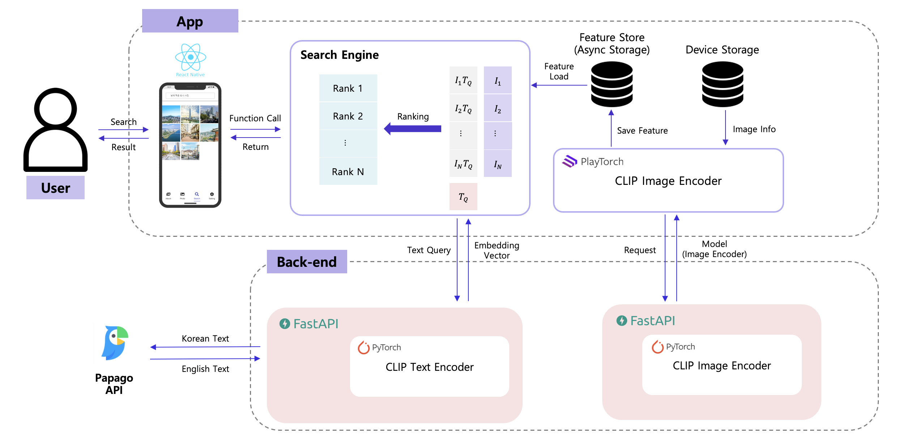

# level3_cv_finalproject-cv-19

<!-- ALL-CONTRIBUTORS-BADGE:START - Do not remove or modify this section -->

[](#contributors-)

<!-- ALL-CONTRIBUTORS-BADGE:END -->

## Introduction


프로젝트 이름 : M. S. G (Mobile Smart Gallary) <br/> <br/> 
주제 : 사용자 갤러리 내 문장 기반 이미지 검색 서비스<br/> <br/>

사용 모델 : CLIP(Contrastive Language-Image Pre-training)

프로젝트 개발 환경 : Ubuntu 18.04.5 LTS, Intel(R) Xeon(R) Gold 5120 CPU @ 2.20GHz, Ram 90GB, Tesla V100 32GB

---

## Contributors

**`V.I.P`** **`==`**
**`✨Visionary Innovative People✨`**

<table>
  <tr>
    <td align="center"><a href="https://github.com/seoin0110"><br /><sub><b>김서인</b></sub></a><br /><a href="https://github.com/seoin0110" title="Code"></td>
    <td align="center"><a href="https://github.com/moons98"><br /><sub><b>문상인</b></sub></a><br /><a href="https://github.com/moons98" title="Code"></td>
    <td align="center"><a href="https://github.com/jaehun-park"><br /><sub><b>박재훈</b></sub></a><br /><a href="https://github.com/jaehun-park" title="Code"></td>
    <td align="center"><a href="https://github.com/adam1206"><br /><sub><b>이강민</b></sub></a><br /><a href="https://github.com/adam1206" title="Code"></td>
     <td align="center"><a href="https://github.com/Jeon-jisu"><br /><sub><b>전지수</b></sub></a><br /><a href="https://github.com/Jeon-jisu" title="Code"></td>
  </tr>
</table>

### 역할

| 팀원   | 역할             |
| ------ | ---------------- |
| 김서인 | 앱 / 백엔드 개발 |
| 문상인 | 모델링           |
| 박재훈 | PM, 앱 개발      |
| 이강민 | 모델링           |
| 전지수 | 앱 개발          |

## 문제 정의


## 서비스 아키텍처



## 모델 성능 비교


## Tech Skill

    

---

## Repository 구조

- Repository 는 다음과 같은 구조로 구성되어 있습니다.

```
├── .github
├── assets
├── src
├── .gitignore
├── App.js
├── README.md
├── app.json
├── babel.config.js
├── index.js
├── metro.config.js
├── package-lock.json
└── package.json
```

---

## Usage

Mac OS version<br/>
Install : Node.js, JAVA 11 SDK, X Code, CocoaPods, watchman, Android Studio, Typescript

```bash
$ git clone https://github.com/boostcampaitech5/level3_cv_productserving-cv-19.git
$ npm install
$ npm run android
```

## 시연 영상

<br/>
